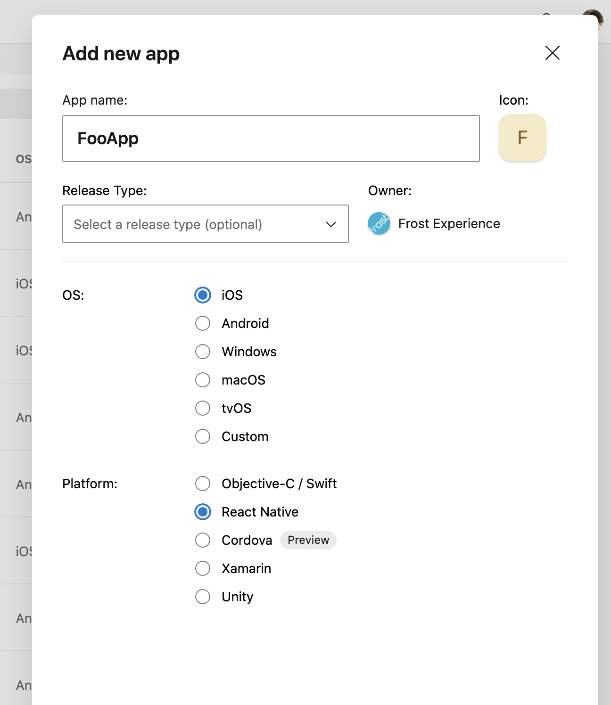
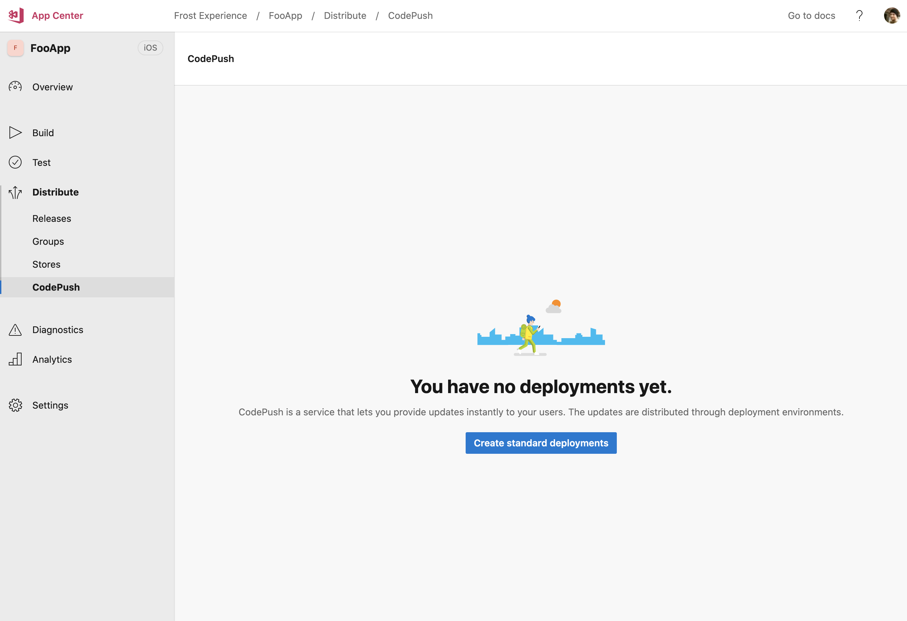
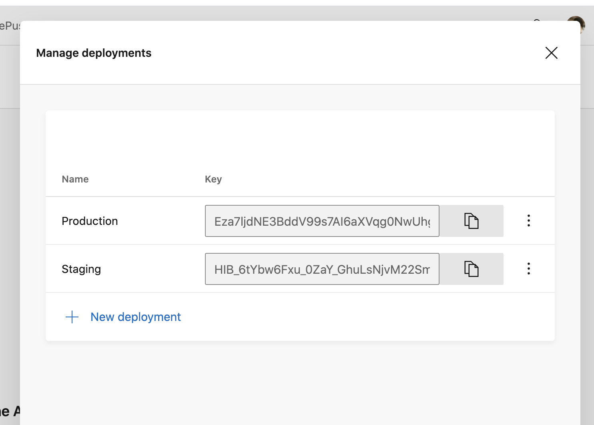

# CodePush

The project is prepared for CodePush to achieve "over the air updates" (OTA).

> Note: Microsoft has aquired CodePush and integrated it into AppCenter. You might find detours while googling, but it is the AppCenter CodePush we are using.

## Getting started

### 1. Create apps in AppCenter

Log into AppCenter and go to [Frost Experience organization](https://appcenter.ms/orgs/frost-appcenter/applications).

Add an app per plattform - one for iOS and other for Android. Make sure to set React Native as Platform. Note that you need to create a new app pair per environment, so if you plan to use CodePush for test and production you would need to create 4 AppCenter apps.



Now navigate to Distribute -> CodePush and enable it:



### 2. Configure deployment keys

Open `code-push.config.ts` and enable CodePush and add deployment keys for each environment. You can find deployment keys either in AppCenter UI or by running AppCenter CLI.

```
appcenter codepush deployment list --app frost-appcenter/ellevio-android -k
```



### 3. Publish an OTA update

> 💥 Publishing OTA updates can (sometimes) be a challange to manage where the publish package native dependencies needs to match the binary version. Make sure you know what you are doing before publishing anything to production 💥

```
appcenter codepush release-react -a frost-appcenter/Origo-iOS-Test -d Production --target-binary-version "1.0.0"
```
