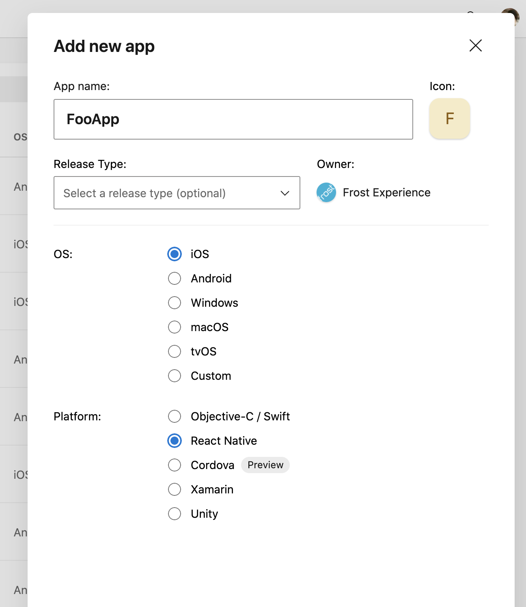
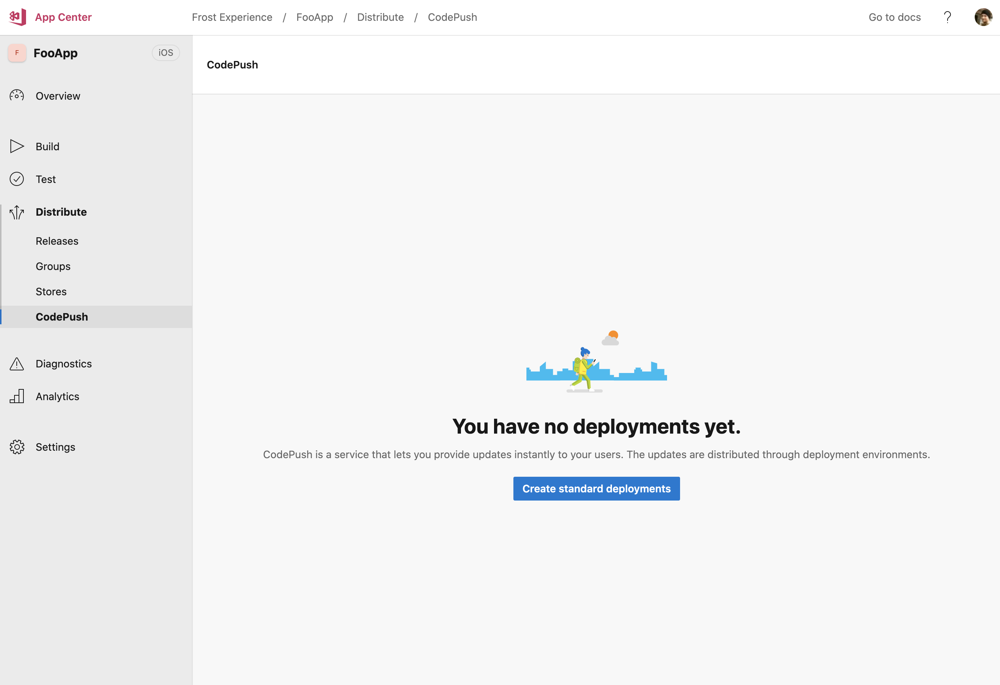
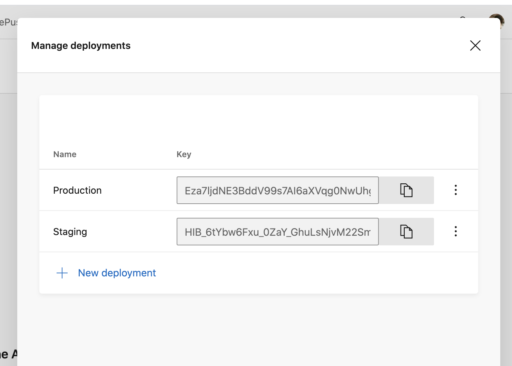

# CodePush

The project is prepared for CodePush to achieve "over the air updates" (OTA).

> Note: Microsoft has aquired CodePush and integrated it into AppCenter. You might find detours while googling, but it is the AppCenter CodePush we are using.

## Getting started

### 1. Create apps in AppCenter

Log into AppCenter and go to [Frost Experience organization](https://appcenter.ms/orgs/frost-appcenter/applications).

Add an app per plattform - one for iOS and other for Android. Make sure to set React Native as Platform. Note that you need to create a new app pair per environment, so if you plan to use CodePush for test and production you would need to create 4 AppCenter apps.



Now navigate to Distribute -> CodePush and enable it:



### 2. Configure deployment keys

Open `code-push.config.ts` and enable CodePush and add deployment keys for each environment. You can find deployment keys either in AppCenter UI or by running AppCenter CLI.

```
appcenter codepush deployment list --app frost-appcenter/ellevio-android -k
```



Add those keys to `/config/config.ts` in `codePush` for each app env.

> Note: Don't be fooled by CodePush naming conventions of **staging** and **production** keys for their default deployments. They still point to the same app, it is just a way of being able to preview and roll out code push changes first to staging and then production, but still targeting the same i.e. prod app.

### 3. Publish an OTA update

> 💥 Publishing OTA updates can (sometimes) be a challange to manage where the publish package native dependencies needs to match the binary version. Make sure you know what you are doing before publishing anything to production 💥

```
appcenter codepush release-react -a frost-appcenter/Origo-iOS-Test -d Production --target-binary-version "1.0.0"
```

## Strategy for publishing

Being able to publish OTA updates is powerful but can also go completely wrong if doing it wrong since the published update need to match the binary app version.

These are the best practises we came up with, but should be decided per-project.

- Embrace semver versioning where **minor** version decides if binary version is compatible with CodePush update. For example (binary) app version `1.2.0` and `1.2.1` should both be compatible if publishing an CodePush update targeted to `1.2.x`.
- Create a git branch for each binary version release named `release/1.2.x` and track any codepush updates in that branch.
